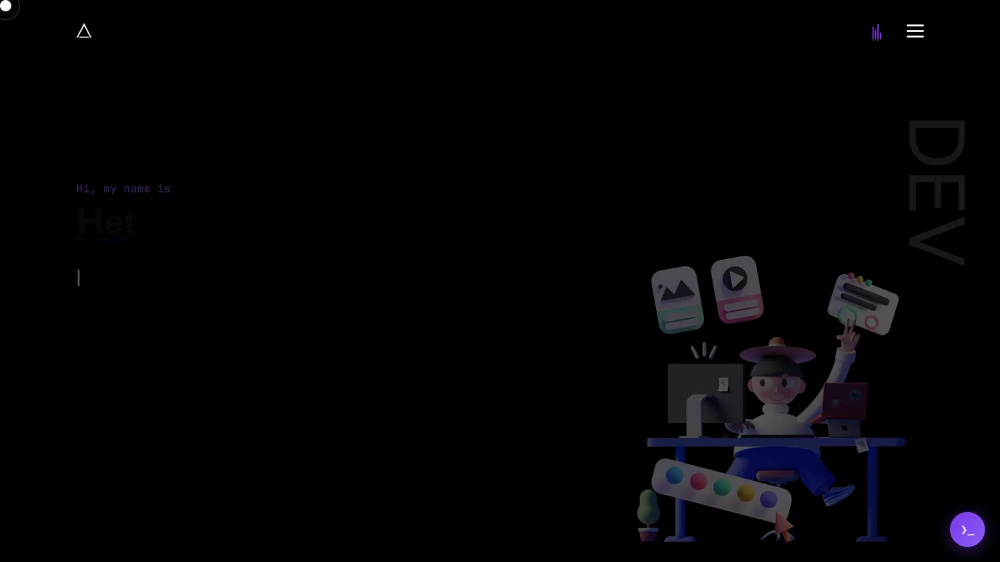
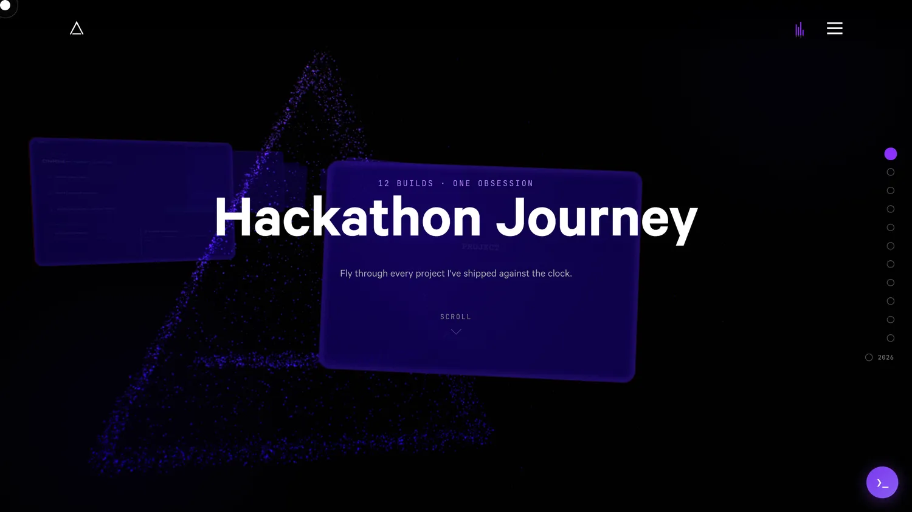
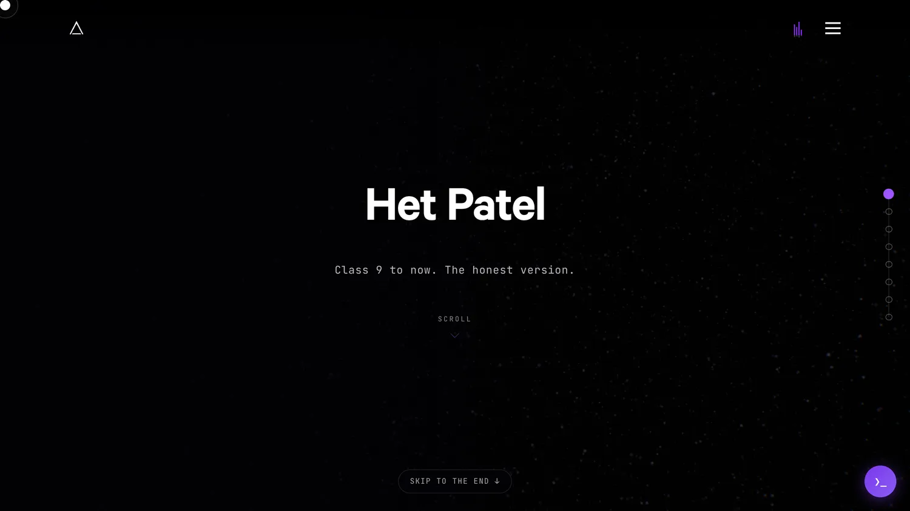
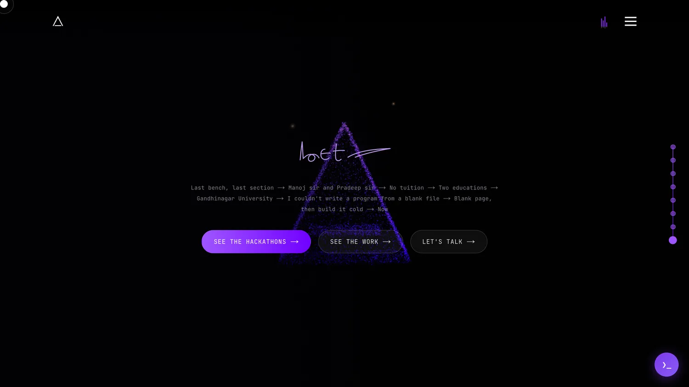
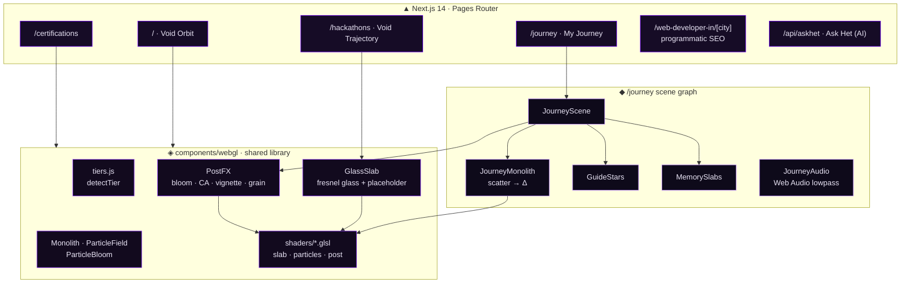
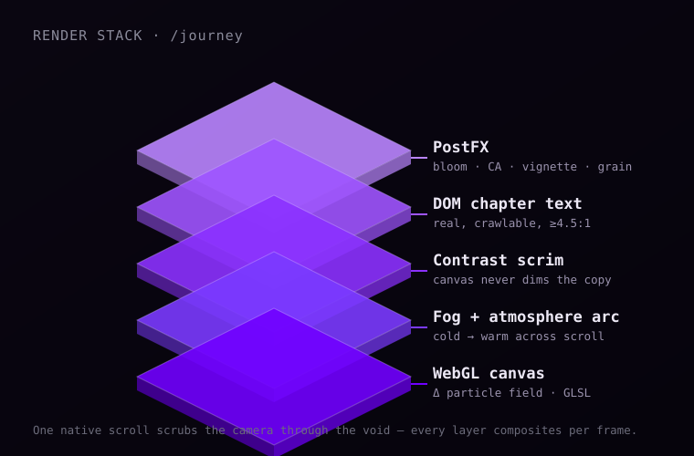
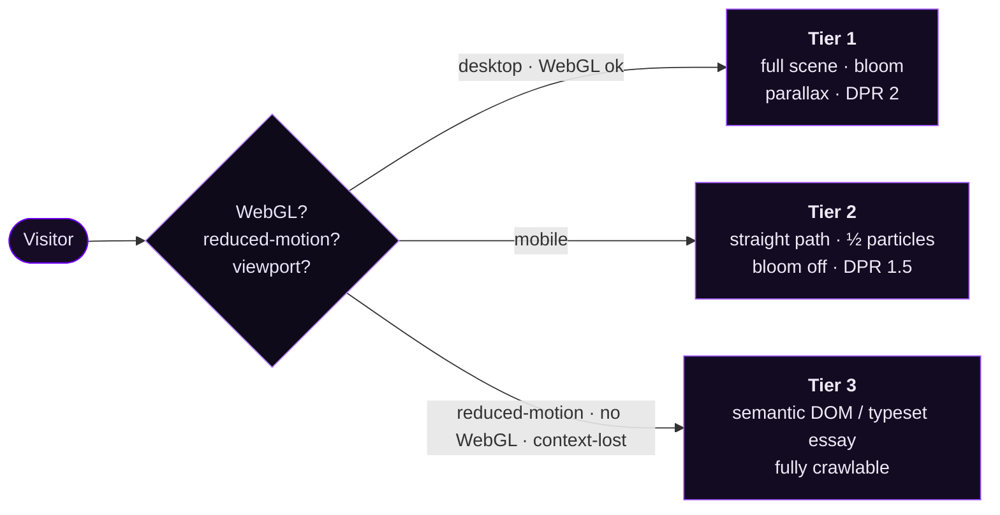
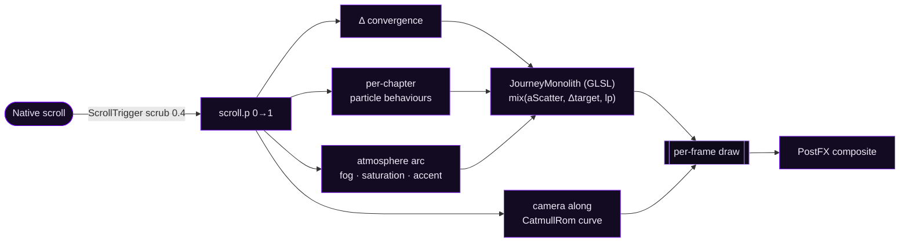

<!-- Animated Δ hero — CSS/SMIL animation plays on GitHub -->
<p align="center">
  
</p>

<p align="center">
  <a href="https://www.buildbyhet.me/"></a>
  
  
  
  
</p>

<p align="center">
  A portfolio that treats WebGL as narrative. Custom GLSL particle systems, a scroll-scrubbed
  camera, a full post-processing chain — and a strict three-tier fallback so it stays fast,
  accessible, and crawlable everywhere.
</p>

---

## ✦ The scenes

Every section is a real-time Three.js scene sharing one particle/post library — no canvas is a video.

<table>
  <tr>
    <td width="50%"></td>
    <td width="50%"></td>
  </tr>
  <tr>
    <td align="center"><b>/ — “Void Orbit”</b><br/><sub>An infinite orbital gallery. Scroll spins the ring; the Δ mark breathes.</sub></td>
    <td align="center"><b>/hackathons — “Void Trajectory”</b><br/><sub>A camera flies a curve past glass-slab stations, one per hackathon.</sub></td>
  </tr>
  <tr>
    <td width="50%"></td>
    <td width="50%"></td>
  </tr>
  <tr>
    <td align="center"><b>/journey — the opening ritual</b><br/><sub>“Class 9 to now. The honest version.” Particles rise; the Δ foreshadows.</sub></td>
    <td align="center"><b>/journey — the Δ assembles</b><br/><sub>Eight chapters scrub the scattered field into a single mark. Then a signature.</sub></td>
  </tr>
</table>

> **See it live → [buildbyhet.me](https://www.buildbyhet.me/)** · [/journey](https://www.buildbyhet.me/journey) · [/hackathons](https://www.buildbyhet.me/hackathons)

---

## ✦ Architecture

One shared `components/webgl` library feeds every scene; each page owns only its choreography.



### The render stack, layer by layer

<p align="center">
  
</p>

---

## ✦ Three-tier rendering

The scene is progressive enhancement, not a requirement. The **text is always real DOM** — the WebGL is the enhancement on top.



If a WebGL context is ever lost mid-session, the page **falls back to Tier 3 in place** — no blank canvas, ever.

---

## ✦ How the Δ assembles (`/journey`)

A single native scroll drives everything; the scene just reads `scroll.p` each frame.



Each chapter gives the field its own character — aimless drift, two guide stars that persist,
a self-organising lattice, two exchanging streams, a redirect-and-curl, a downward sag — all
faded out by assembly so nothing fights the final lock.

---

## ✦ Tech stack

| Layer | Tools |
| :-- | :-- |
| **Framework** | Next.js 14 (Pages Router) · React 18 · TypeScript |
| **3D / GPU** | Three.js r0.185 · custom GLSL (vertex + fragment) · EffectComposer post chain |
| **Motion** | GSAP 3 · ScrollTrigger · ScrollToPlugin · Framer Motion |
| **Audio** | Web Audio API (lowpass filter chain) · Howler |
| **Styling** | Tailwind CSS 3 · SCSS Modules · CSS custom-property design tokens |
| **Media** | `sharp` build-time WebP pipeline · `ffmpeg` video compression |
| **Deploy** | Vercel (push-to-`main`) |

---

## ✦ Project structure

```
devfolio/
├─ pages/                     Next.js routes
│  ├─ index.js                Void Orbit — projects ring
│  ├─ hackathons.js           Void Trajectory — flythrough
│  ├─ journey.js              My Journey — narrative scroll
│  ├─ certifications.js
│  └─ api/askhet.ts           "Ask Het" AI endpoint
├─ components/
│  ├─ webgl/                  shared 3D library
│  │  ├─ tiers.js             capability detection → Tier 1/2/3
│  │  ├─ PostFX.js            bloom · chromatic aberration · vignette · grain
│  │  ├─ GlassSlab.js         fresnel glass slab + placeholder pipeline
│  │  ├─ Monolith · ParticleField · ParticleBloom
│  │  └─ shaders/             slab · particles · post GLSL
│  └─ Journey/                the /journey scene
│     ├─ JourneyScene.js      camera curve · atmosphere arc · raycast
│     ├─ JourneyMonolith.js   the assembling Δ (isolated shader)
│     ├─ GuideStars · MemorySlabs · JourneyAudio · SignatureDraw
│     └─ JourneyEssay.js      Tier-3 crawlable long-form
└─ constants.js               all content (projects, hackathons, journey)
```

---

## ✦ Run it locally

```bash
bun install     # or: npm install
bun dev         # or: npm run dev
```

Open **http://localhost:3000**.

```bash
bun run build   # production build
```

> **Media pipeline:** raw originals stay out of git; `sharp` emits optimised `_opt` WebP and
> only referenced PDFs / compressed video are committed.

---

<p align="center">
  <sub>Built by <a href="https://www.buildbyhet.me/">Het Patel</a> · every pixel on this site is code.</sub>
</p>
